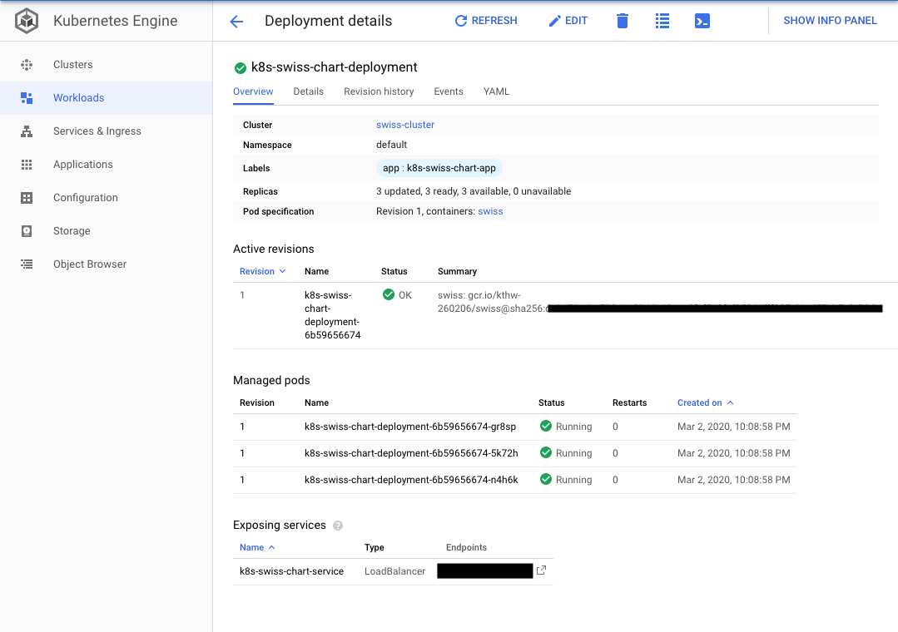
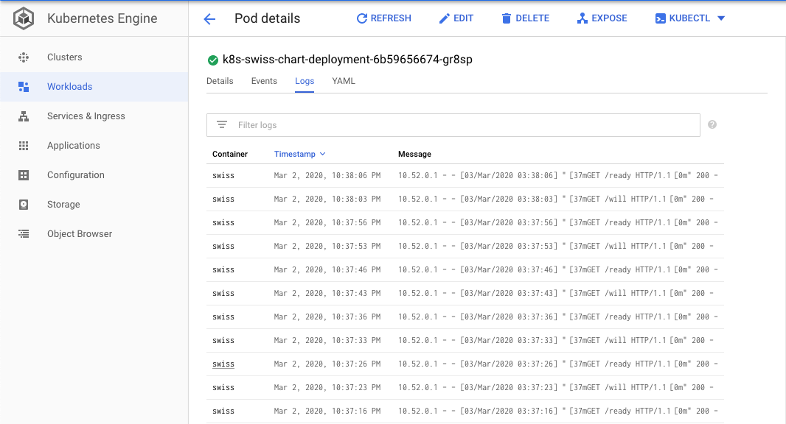
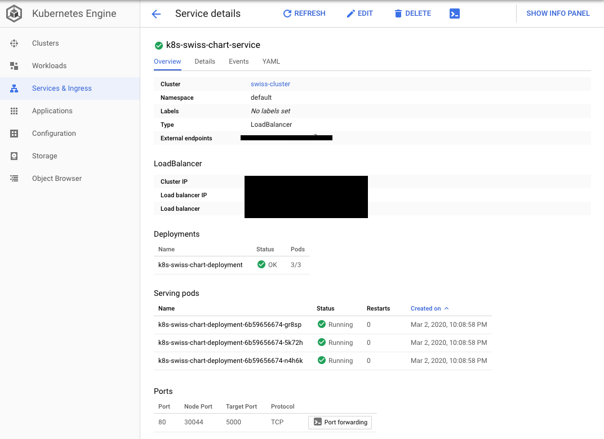

# GKE-Flask-HELM
A simple project to automate the build and deployment for a Flask Application in GKE.

## Mission Statement:
This project is composed of three parts:

- Backend Application
- Container Creation
- Helm Chart Templating

This guide will go over the process of creating the backend application which is a simple REST API with two routes /will which returns "Hello World" in JSON format and /ready route which returns "It works!" in JSON format. We will walk through the process of containerzing this application in a light weight and secure manner. And finaly, we'll cover templating the deployment phase of our application using Helm. Our templating will cover deploying TCP liveness and readiness probes on each routes to allow for durability and availability of our application.

## Prerequisites:
The following is a list of dependencies to follow along:

- Deploy a kubernetes cluster on GCP using GKE. (This can be done with the below mentioned commands)
- Navigate to Cloud Shell on GCP console and start a terminal. Run the following commands:

        >  gcloud config set project <project-id>
        >  gcloud config set compute/zone <compute-zone>
        >  gcloud container clusters create <cluster-name> --num-nodes=1
        >  gcloud container clusters get-credentials <cluster-name>

The above steps will configure our project, compute/zone, create a one-node cluster for this simple application and configure authentication credentials to interact with the cluster.

- Download Helm 3 from https://helm.sh/docs/intro/install/ by using wget. This will download the tar. Untar helm binary and place it in /usr/local/bin

**Note: For security best practices we use Helm 3 and not Helm 2. This is in favor of the security concerns around Helm 2 using a server side named Tiller. You can ready more about Security concerns surrounding Helm 2 here: https://engineering.bitnami.com/articles/helm-security.html**

- Cloud Shell comes with Docker, which we will use to build our docker image. 
- We will also make use of Google Container Registry to host our image and pull during deployment phase.

## Design:

### Backend Application:

Our backend application is a simple Flask application under the path app/app.py. The app listens on port 5000 for the routes /will and /ready and returns 'Hello World' and 'It works!' respectively. The responses are in JSON format using JSONIFY.

### Containerization:

In order to keep our docker image light-weight and secure we're using an apline image which on its own is 97.8MB, and with our application on top amounts to 108MB. This removes the unnecessary overhead of tools that are not relevant to our application or our needs and provides a hardening approach to our application. Our containerization approach further comes in handy when we deploy to GKE and are able to call our image during deployment phase and allows for future revisions to be rolled out at faster rate as opposed to a bare metal deployment of our application.

### Helm Chart:

Helm allows us to manage our application deployment to GKE. Helm Chart makes it easy to create, version, manage our application releases to Kubernetes. The Helm Chart defined our repo abstracts the deployment of our application inside /templates/application.yaml file. Our end goal is to pull our docker image from Google Container Registry (GCR) and create a Kubernetes deployment and a service to deploy and expose our application. Our application.yaml file is split into two parts:

- Deployment:

This will create a deployment of our application with 3 replicas of our container image running our application. We map the name of our chart from helpers.tpl here. We also create Liveness and Readiness probes to create a health check of our application. The liveness check runs at the route "/will" and restarts a container that will fail to respond with a 200 code for 3 attempts in a row over 10 attempts which equates to 30 seconds of failure. The Readiness check follows the same trend, however it's setup with the route "/ready" and has an initial delay of 30 seconds. Since our application is pretty lightweight with minimum dependencies, our initial delay is small, however for larger applications our initial delay would grow as our application might take a while to respond to requests.

- Service:

The Service piece allows our deployment to be exposed via a Load Balancer deployed in GKE. We map port 80 on the Load Balancer to forward requests to target port 5000 of our deployment. 

## Build and Deploy:

- In our Cloud Shell terminal clone this repository. 
- Run the following commands:

        >  cd GKE-Flask-Helm
        >  docker build -t swiss:v1 .
        >  docker tag swiss:v1 gcr.io/<project-id>swiss:v1
        >  gcloud auth configure-docker
        >  docker push gcr.io/<project-id>swiss:v1

The above commands will build our docker image, tag it, configure our authentication with GCR and push our docker image to GCR. Please make note of the Image Tag you applied since this image tag is passed to Helm Chart to deploy our application.

- To deploy our application, the steps are as simple as follows:

        >  helm install k8s ./swiss-chart/

**The below image shows the deployment created through Helm chart. 3 replicas are created through our deployment.**

**Under the logs tab for our deployment we can see the liveness and readiness probes calling our routes and receiving 200 OK responses.**

**Under Services & Ingress tab we can see our Service got created. The Load Balancer's IP is listed and we can use the IP in our browser to follow the routes <IP-Address>/will and <IP-Address>/ready to confirm our Application is exposed as promised.**

### Best Practices:

This repo covers the bare minimum to get started with GKE. A simple application built with docker and deployed via Helm. Although a good place to start, there are quite a few things that can be automated/improved here. The following is an incomprehensive list of improvements to this repo:

- Build GKE cluster via Terraform/Deployment Manager (Infrastructure as Code). Store the configuration in a Git repo which allows you to release safer, consistent and version controled Infrastructure.
- Build a CI/CD pipeline that can be triggered using a commit to this repository. A webhook can be created to poll this repo for commits to lets say the "develop" branch. The trigger would start the CI/CD pipeline, build your docker image and call help to deploy an updated revision of your application. Jenkins, CircleCI and GitLab can be your starting point.
- Multiple branches can be created of this pipeline to deploy Production ready, QA ready or Dev ready application code to their respective GKE Environments.
- Logging and monitoring solutions like an ELK Stack can be deployed as the complexity of our application grows and we need to monitor infrastructure and application logs.
