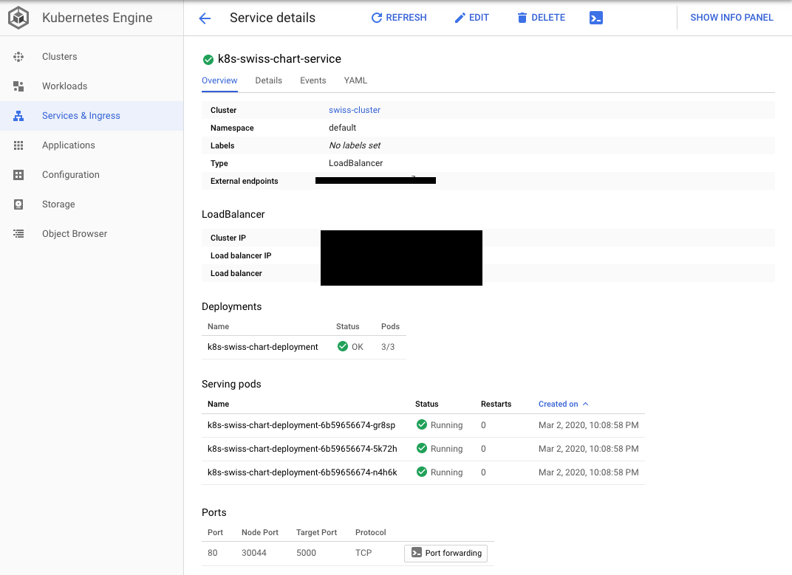
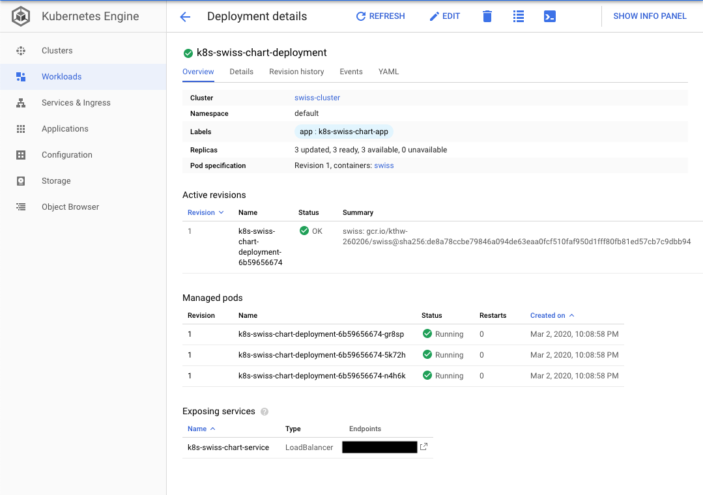

# GKE-Flask-HELM
A simple project to automate the build and deployment for a Flask Application in GKE.

## Mission Statement:
This project is composed of three parts:

- Backend Application
- Container Creation
- Helm Chart Templating

This guide will go over the process of creating the backend application which is a simple REST API with two routes /will which returns "Hello World" in JSON format and /ready route which returns "It works!" in JSON format. We will walk through the process of containerzing this application in a light weight and secure manner. And finaly, we'll cover templating the deployment phase of our application using Helm. Our templating will cover deploying TCP liveness and readiness probes on each routes to allow for durability and availability of our application.

## Prerequisites:
The following is a list of dependencies to follow along:

- Deploy a kubernetes cluster on GCP using GKE. (This can be done with the below mentioned commands)
- Navigate to Cloud Shell on GCP console and start a terminal. Run the following commands:

        >  gcloud config set project <project-id>
        >  gcloud config set compute/zone <compute-zone>
        >  gcloud container clusters create <cluster-name> --num-nodes=1
        >  gcloud container clusters get-credentials <cluster-name>

The above steps will configure your project, compute/zone, create a one-node cluster for this simple application and configure authentication credentials to interact with the cluster.

- Download Helm 3 from https://helm.sh/docs/intro/install/ by using wget. This will download the tar. Untar helm binary and place it in /usr/local/bin
- Cloud Shell comes with Docker, which we will use to build our docker image. 
- We will also make use of Google Container Registry to host our image and pull during deployment phase.

